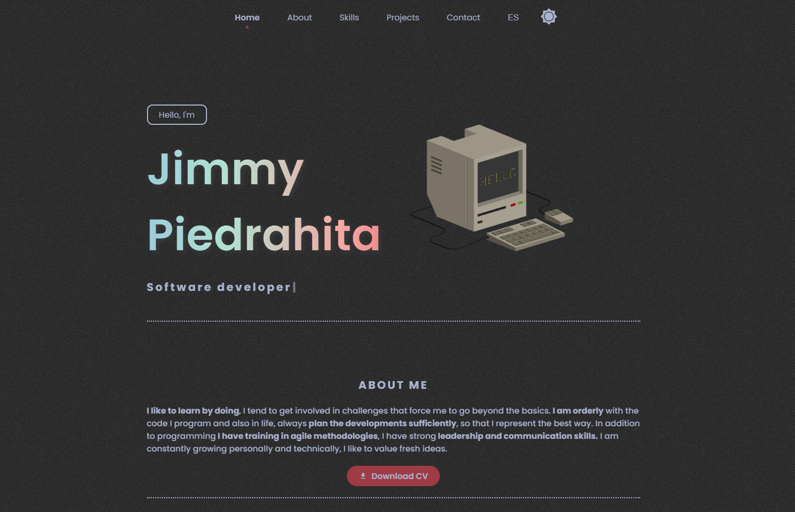

# Portfolio Personal de Jimmy Piedrahita



## 🚀 Descripción

Este es mi portafolio personal como desarrollador Full Stack. Una plataforma interactiva donde muestro mis proyectos y habilidades técnicas. Diseñado con un enfoque en la experiencia de usuario y la estética visual moderna.

## ✨ Características principales

- **Diseño responsive**: Visualización óptima en dispositivos móviles, tablets y escritorio
- **Soporte multilenguaje**: Disponible en español e inglés
- **Modo claro/oscuro**: Personalización de la experiencia visual
- **Modelo 3D interactivo**: Laptop 3D creada con Three.js y React Three Fiber
- **Efecto de cursor personalizado**: Blob dinámico que sigue el cursor
- **Filtrado de proyectos por categoría**: Web, móvil y videojuegos
- **Formulario de contacto funcional**: Integración con Formspree
- **Animaciones suaves**: Transiciones y efectos visuales con GSAP

## 🛠️ Tecnologías utilizadas

- **React 19**: Framework de JavaScript para la interfaz de usuario
- **Vite**: Herramienta de construcción y servidor de desarrollo
- **Three.js**: Biblioteca para crear y mostrar gráficos 3D
- **React Three Fiber**: Renderer de React para Three.js
- **GSAP**: Biblioteca para animaciones avanzadas
- **Formspree**: Servicio para manejo de formularios
- **React Icons**: Iconos para la interfaz de usuario
- **CSS personalizado**: Estilizado completamente a mano sin frameworks CSS

## 🏗️ Estructura del proyecto

```
├── public/               # Archivos estáticos
│   ├── documents/        # CV y otros documentos
│   ├── models/           # Modelos 3D
│   └── favicon.ico       # Ícono del sitio
├── src/
│   ├── assets/           # Imágenes e iconos
│   ├── components/       # Componentes React reutilizables
│   ├── contexts/         # Contextos para temas e idiomas
│   ├── hooks/            # Hooks personalizados
│   ├── styles/           # Archivos CSS por componente
│   ├── translations/     # Archivos de traducción
│   ├── App.jsx           # Componente principal
│   └── main.jsx          # Punto de entrada
├── index.html            # Plantilla HTML
├── package.json          # Dependencias
└── vite.config.js        # Configuración de Vite
```

## 🚀 Instalación y ejecución

1. Clona el repositorio:
```bash
git clone https://github.com/JimmyPiedrahita/Portfolio-dev.git
```

2. Instala las dependencias:
```bash
cd Portfolio-dev
pnpm install  # También puedes usar: npm install
```

3. Ejecuta el servidor de desarrollo:
```bash
pnpm dev  # También puedes usar: npm run dev
```

4. Abre [http://localhost:5173](http://localhost:5173) en tu navegador para ver el resultado.

## 📦 Build para producción

Para crear una versión optimizada para producción:

```bash
pnpm build  # También puedes usar: npm run build
```

Para previsualizar la versión de producción:

```bash
pnpm preview  # También puedes usar: npm run preview
```

## 🔍 Funcionalidades principales

### Modelo 3D interactivo
Utilizo Three.js y React Three Fiber para renderizar un modelo 3D de laptop interactivo que responde a eventos de mouse y se integra perfectamente con el tema de la página.

### Cambio de tema (claro/oscuro)
El sitio cuenta con un sistema completo de temas que permite al usuario cambiar entre modo claro y oscuro, guardando la preferencia en localStorage.

### Soporte multilingüe
Implementación completa de i18n para soportar español e inglés, con la posibilidad de añadir más idiomas fácilmente.

### Filtrado de proyectos
Los proyectos pueden filtrarse por categorías (web, móvil, videojuegos) para facilitar la navegación.

### Efecto de cursor personalizado
Un blob dinámico sigue el cursor, creando una experiencia interactiva única.

### Formulario de contacto
Integración con Formspree para un formulario de contacto totalmente funcional.

## 👨‍💻 Autor

**Jimmy Piedrahita** - Desarrollador Full Stack

- GitHub: [@JimmyPiedrahita](https://github.com/JimmyPiedrahita)
- LinkedIn: [Jimmy Piedrahita](https://www.linkedin.com/in/jimmypiedrahita/)

## 📄 Licencia

Este proyecto está bajo la Licencia MIT - ver el archivo [LICENSE](LICENSE) para más detalles.